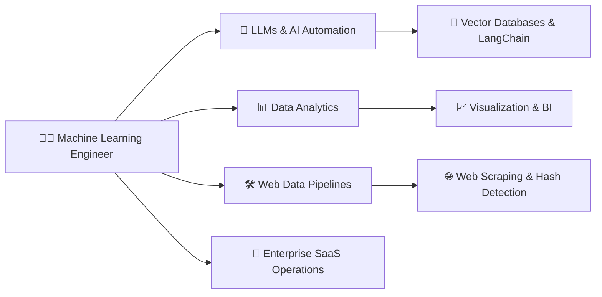
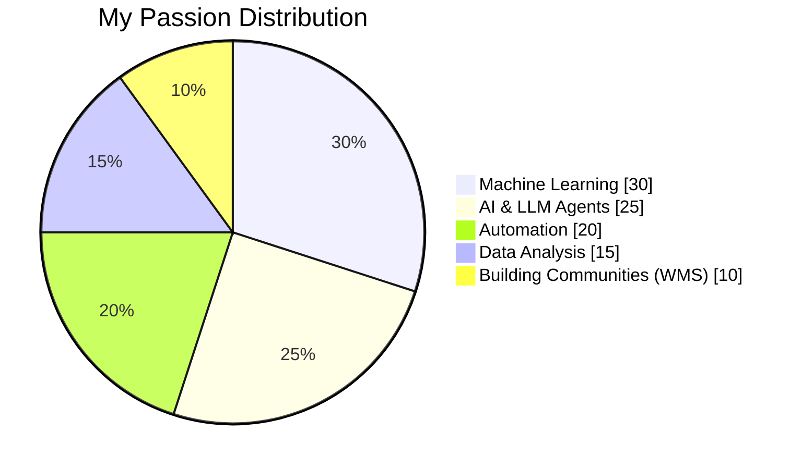
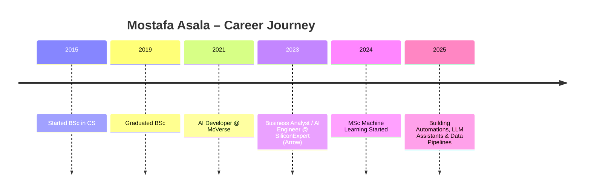
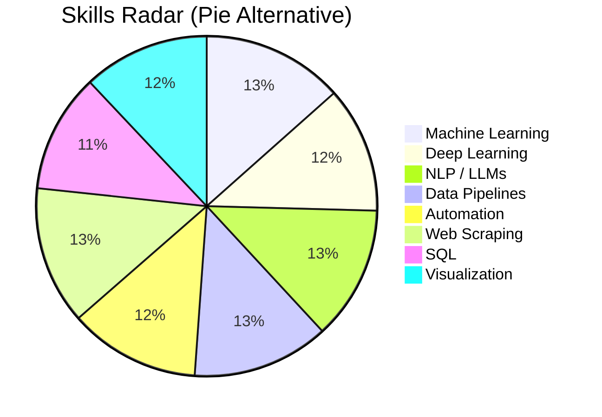
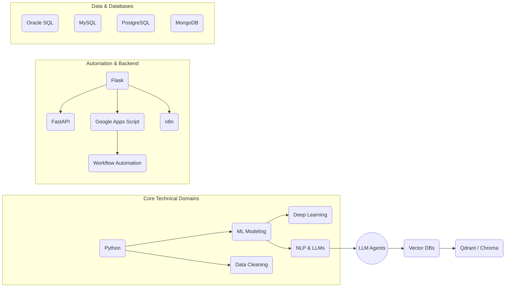
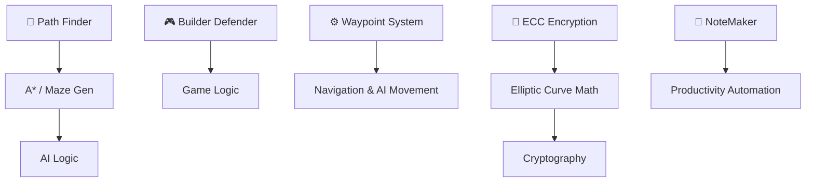
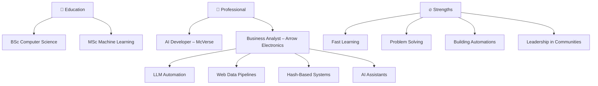

---

# ⭐ **Mostafa Asala**

  

  

---

# 🎨 **Profile Overview (Interactive UI)**

---

# 📊 **Live GitHub Metrics**

### ✔ **Profile Views**

> 

### ✔ **Github Performance Dashboard**

### ✔ **Top Languages**

### ✔ **Contribution Streak**

---

# 🔥 **My Passion (Interactive Mermaid Pie Chart)**

---

# 🧑‍💼 **Work Experience Timeline**

---

# 🛠 **Skill System (Interactive Mermaid Radar Chart)**

*(GitHub supports Mermaid, so this renders beautifully)*

*(Note: Mermaid radar is experimental; GitHub renders it.)*

---

# 🛠 **Interactive Skills Overview (Flow Layout)**

---

# 🚀 **Highlighted Projects (Visual Map)**

---

# 📂 **Project Badges**

| Project         | Badge                                                         |
| --------------- | ------------------------------------------------------------- |
| Path Finder     |  |
| BuilderDefender |           |
| Waypoint System |         |
| ECC Encryption  |    |
| NoteMaker       |     |

---

# 🚀 **General Overview (Mermaid Dashboard)**

---

# 🧭 **Professional Mission Statement**

> *“I build ML-driven automation systems that make teams faster, smarter, and more scalable.”*

---

# 📫 **Let’s Connect**

* 🔗 LinkedIn → *([LinkedIn](https://www.linkedin.com/in/mosatafa-asla/))*
* 📧 Email → *(mostafamohmed951@gmail.com)*

----

